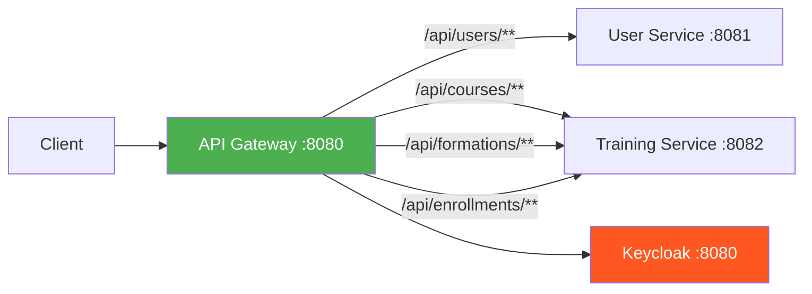

# API Gateway Documentation

> **Module**: `api-gateway`  
> **Port**: `8080`  
> **Spring Cloud Version**: `2023.0.3`

This document provides comprehensive documentation for the API Gateway service in the Training Management Platform.

---

## 🏗️ Architecture Overview

The API Gateway is the **single entry point** for all client requests to the Training Management Platform. Built on Spring Cloud Gateway (reactive/WebFlux), it provides:



### Core Responsibilities

| Feature | Description |
|---------|-------------|
| **Routing** | Forwards requests to appropriate microservices based on URL patterns |
| **Security** | Validates JWT tokens issued by Keycloak |
| **Monitoring** | Exposes health and metrics via Spring Boot Actuator |
| **Resilience** | Circuit breakers and rate limiting via Resilience4j |
| **Path Rewriting** | Transforms incoming paths before forwarding to services |

---

## 📂 Project Structure

```
api-gateway/
├── src/
│   ├── main/
│   │   ├── java/com/training/platform/gateway/
│   │   │   ├── ApiGatewayApplication.java    # Main entry point
│   │   │   ├── config/
│   │   │   │   └── SecurityConfig.java       # WebFlux security configuration
│   │   │   └── util/
│   │   │       └── GatewayUtils.java         # Utility methods
│   │   └── resources/
│   │       └── application.yml               # Gateway configuration
│   └── test/
│       └── java/com/training/platform/gateway/
│           ├── ApiGatewayApplicationTests.java
│           ├── GatewayIntegrationTest.java
│           ├── GatewayRoutingTest.java
│           ├── config/
│           │   └── SecurityConfigTest.java
│           └── util/
│               └── GatewayUtilsTest.java
├── Dockerfile
└── pom.xml
```

---

## 🔧 Configuration

### Route Configuration (`application.yml`)

The gateway routes requests based on path patterns:

```yaml
spring:
  cloud:
    gateway:
      routes:
        # User Service Routes
        - id: user-service
          uri: http://localhost:8081
          predicates:
            - Path=/api/users/**
          filters:
            - RewritePath=/api/users/(?<segment>.*), /${segment}
        
        # Training Service Routes  
        - id: training-service
          uri: http://localhost:8082
          predicates:
            - Path=/api/formations/**,/api/courses/**,/api/enrollments/**
          filters:
            - RewritePath=/api/(?<segment>.*), /${segment}
```

### Route Mapping Reference

| Incoming Path | Target Service | Rewritten Path |
|---------------|---------------|----------------|
| `/api/users/me` | User Service (:8081) | `/me` |
| `/api/users/profile` | User Service (:8081) | `/profile` |
| `/api/courses/1` | Training Service (:8082) | `/courses/1` |
| `/api/formations/list` | Training Service (:8082) | `/formations/list` |
| `/api/enrollments/enroll` | Training Service (:8082) | `/enrollments/enroll` |

### OAuth2/JWT Configuration

```yaml
spring:
  security:
    oauth2:
      resourceserver:
        jwt:
          issuer-uri: http://localhost:8080/realms/training-platform-realm
```

---

## 🔐 Security

### Security Configuration

The gateway uses **WebFlux Security** with OAuth2 JWT validation:

```java
@Configuration
@EnableWebFluxSecurity
public class SecurityConfig {
    @Bean
    public SecurityWebFilterChain securityWebFilterChain(ServerHttpSecurity http) {
        http.csrf(ServerHttpSecurity.CsrfSpec::disable)
            .httpBasic(ServerHttpSecurity.HttpBasicSpec::disable)
            .authorizeExchange(ex -> ex
                .pathMatchers("/actuator/**").permitAll()  // Public
                .anyExchange().authenticated()              // Protected
            )
            .oauth2ResourceServer(oauth2 -> oauth2.jwt(jwt -> {}));
        return http.build();
    }
}
```

### Access Control Summary

| Path Pattern | Access Level | Authentication Required |
|--------------|--------------|------------------------|
| `/actuator/**` | Public | ❌ No |
| `/api/**` | Protected | ✅ Yes (JWT) |
| All other paths | Protected | ✅ Yes (JWT) |

### Expected HTTP Responses

| Scenario | Status Code |
|----------|-------------|
| Valid JWT token | `200 OK` (or downstream response) |
| Missing JWT token | `401 Unauthorized` |
| Invalid/expired JWT | `401 Unauthorized` |
| Actuator endpoints | `200 OK` (always) |

---

## 🛠️ Utility Classes

### GatewayUtils

Located at `util/GatewayUtils.java`, provides helper methods:

| Method | Description | Example |
|--------|-------------|---------|
| `formatServicePath(service, path)` | Formats a service path | `formatServicePath("user", "/profile")` → `/user/profile` |
| `generateCorrelationId(prefix)` | Generates unique request ID | `generateCorrelationId("REQ")` → `REQ-a1b2c3d4` |
| `isValidPath(path)` | Validates API path format | `isValidPath("/api/users")` → `true` |

---

## 📦 Dependencies

### Core Dependencies

| Dependency | Purpose |
|------------|---------|
| `spring-cloud-starter-gateway` | Reactive API Gateway engine |
| `spring-boot-starter-actuator` | Health checks and monitoring |
| `spring-boot-starter-oauth2-resource-server` | JWT token validation |
| `resilience4j-spring-boot3` | Circuit breakers, rate limiting |

### Test Dependencies

| Dependency | Purpose |
|------------|---------|
| `spring-boot-starter-test` | JUnit 5, Mockito, AssertJ |
| `spring-security-test` | Security testing utilities |
| `spring-cloud-contract-wiremock` | Mock HTTP services for integration tests |

---

## 🧪 Testing

### Test Suite Overview

| Test Class | Tests | Coverage |
|------------|-------|----------|
| `ApiGatewayApplicationTests` | 1 | Context loading |
| `SecurityConfigTest` | 5 | Security filter chain, access control |
| `GatewayIntegrationTest` | 2 | Route rewriting with WireMock |
| `GatewayRoutingTest` | 1 | Route configuration verification |
| `GatewayUtilsTest` | 3 | Utility method unit tests |
| **Total** | **13** | ✅ All passing |

### Running Tests

```bash
# Run all api-gateway tests
mvn test -pl api-gateway

# Run with coverage report
mvn test jacoco:report -pl api-gateway

# Run specific test class
mvn test -pl api-gateway -Dtest=SecurityConfigTest
```

---

## 🚀 Operations Guide

### Building

```bash
# Build the gateway module only
mvn clean package -pl api-gateway -DskipTests

# Build with all quality checks
mvn clean verify -pl api-gateway -am
```

### Running Locally

```bash
# From api-gateway directory
cd api-gateway
mvn spring-boot:run

# Or with specific profile
mvn spring-boot:run -Dspring-boot.run.profiles=dev
```

### Docker

```bash
# Build Docker image
cd api-gateway
mvn clean package -DskipTests
docker build -t training-platform/api-gateway .

# Run container
docker run -p 8080:8080 training-platform/api-gateway
```

---

## 📊 Monitoring

### Actuator Endpoints

All actuator endpoints are publicly accessible at `/actuator/**`:

| Endpoint | URL | Description |
|----------|-----|-------------|
| Health | `http://localhost:8080/actuator/health` | Service health status |
| Info | `http://localhost:8080/actuator/info` | Application info |
| Metrics | `http://localhost:8080/actuator/metrics` | Performance metrics |
| Gateway Routes | `http://localhost:8080/actuator/gateway/routes` | Configured routes |

### Health Check Example

```bash
curl http://localhost:8080/actuator/health
```

Expected response:
```json
{
  "status": "UP"
}
```

---

## 🔧 Quality Tools

The gateway inherits quality plugins from the parent POM:

| Tool | Purpose | Command |
|------|---------|---------|
| **Checkstyle** | Code style enforcement | `mvn checkstyle:check` |
| **JaCoCo** | Code coverage (80% minimum) | `mvn jacoco:report` |
| **PIT** | Mutation testing (85% threshold) | `mvn pitest:mutationCoverage` |
| **OWASP** | Dependency vulnerability scan | `mvn dependency-check:check` |

---

## � Troubleshooting

### Common Issues

| Issue | Cause | Solution |
|-------|-------|----------|
| `401 Unauthorized` on all requests | Keycloak not running | Start Keycloak with `docker-compose up keycloak` |
| `503 Service Unavailable` | Backend service down | Ensure user-service/training-service are running |
| JWT validation fails | Wrong issuer URI | Check `spring.security.oauth2.resourceserver.jwt.issuer-uri` |
| Routes not working | Configuration error | Check `application.yml` route predicates |

### Debug Logging

Enable debug logging for troubleshooting:

```yaml
logging:
  level:
    org.springframework.cloud.gateway: DEBUG
    org.springframework.security: DEBUG
```

---

## 📚 Related Documentation

- [Docker Setup](./DOCKER_SETUP.md) - Container configuration
- [Keycloak Integration](./KEYCLOAK_INTEGRATION.md) - Authentication setup
- [CI/CD Pipeline](./CI_CD.md) - Build and deployment
- [Testing Guide](./TESTING_GUIDE.md) - Testing strategies

---

*Last updated: January 2026*
